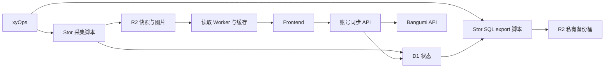

# AiringCal

展示 Bangumi 收藏与放送日历，提供用户主动发起的双账号对比、同步。

当前分支完成 P1 代码收敛，P2 正在运行验证；生产切换尚未完成。开发采用 Ponytail，优先复用现有代码与平台能力，保留校验、超时、错误脱敏和发布完整性检查。

## 模块边界

| 模块 | 负责内容 | 运行位置 |
| --- | --- | --- |
| `apps/frontend-worker`、`packages/widget` | 页面、最新快照跟踪、账号同步界面 | Worker / 浏览器 |
| `apps/read-worker` | 读取 R2 最新指针、采集进度、版本快照及图片，实施缓存 | Worker |
| `apps/sync-worker` | 双账号 compare/apply/check；D1 操作日志 | Worker |
| [xyOps-Stor](https://github.com/Skyline-Gazer/xyOps-Stor) 的 `airingcal-sync` | 完整采集、媒体刷新、D1 状态、R2 发布 | xyOps 启动 xySat 上的一次性脚本 |
| Stor 的 `airingcal-backup` | D1 SQL export，上传独立私有 R2 桶并校验 | xyOps 启动 xySat 上的一次性脚本 |

沿用现有 Worker 名和 service binding：`airing-cal-frontend`、`airing-cal-read`、`airing-cal-sync`。Jobs 的实际实现和调度定义归 Stor 所有。xyOps 执行节点仍需要 Node.js 和已安装的 Stor 依赖；脚本执行完成后退出，不需要项目常驻服务。



## 最新数据与缓存

- `airing-cal-data/public/manifest.json` 指向最近成功发布的完整快照。
- `public/status.json` 提供采集阶段、最近观测时间、最近发布时间和脱敏错误码。失败的采集保留已有发布。
- 版本快照为 `snapshots/v1/<generation>-<content_sha256>.json`，内容 hash 不含 generation / 发布时间；内容未变化时继续使用原版本。
- 图片为 `airing-cal-images/images/<sha256>/original`，以字节 hash 定址。
- 页面打开、返回可见窗口、激活展示视图和可见期间每 30 秒检查指针。新版本完整读取后，收藏与日历一起切换；失败保留已显示内容并自动重试。首次没有发布时显示等待采集。
- 账号同步每批最多 5 项，Token 只保存在当前页面内存，不写入 D1 日志。同步后，公开展示在**下一次定时采集成功发布**后更新。

| 内容 | 缓存位置与策略 |
| --- | --- |
| HTML | `no-cache`，页面加载时重新验证 |
| JS / CSS | 浏览器短缓存 5 分钟 |
| manifest、status；账号 API / 日志 | `no-store`；最新指针和进度直接通过 R2 binding 读取 |
| 版本快照 | read-worker 的 Cloudflare Cache API + 浏览器，30 天 `immutable`；R2 回源验证 schema、hash 和版本 |
| hash 图片 | read-worker 的 Cloudflare Cache API + 浏览器，1 年 `immutable` |

Cache API 在各边缘位置分别缓存，首次请求回源 R2。更新无需逐项清 CDN，也不缓存错误响应。R2 桶可保持私有，由 Worker 按规定路径提供展示数据。

## 公共接口

| 方法与路径 | 返回内容 |
| --- | --- |
| `GET /api/manifest`、`GET /api/status` | 最新发布指针 / 脱敏采集状态 |
| `GET /api/snapshots/v1/<generation>-<hash>.json` | 固定版本完整快照 |
| `GET /image/<hash>` | 固定 hash 图片 |
| `GET /api/collections?type=watching&page=1&limit=24`、`GET /api/calendar` | 最近发布的分页收藏 / 日历；页面本身从固定版本快照取数据 |
| `GET /api/health`、`GET /api/cache`、`GET /api/config` | 发布健康摘要 / 收藏数量与版本 / NSFW 配置 |
| `POST /api/sync/compare`、`POST /api/sync/apply` | 双账号对比 / 最多五项同步；apply 不接受无范围的全量执行 |
| `GET /api/check/<id>` | 24 小时内的操作日志，支持 JSON Accept 或 HTML |

## 资源与配置

| 资源 | 名称 / binding |
| --- | --- |
| D1 | `airing-cal-state`；sync-worker 的 `AIRING_CAL_D1` |
| 快照 R2 | `airing-cal-data`；read-worker 的 `AIRING_CAL_DATA_R2` |
| 图片 R2 | `airing-cal-images`；read-worker 的 `AIRING_CAL_R2` |
| 私有 SQL 备份 R2 | `airing-cal-backups`；无 Worker 公共读取 binding |

Staging uses separate Workers (`airing-cal-staging-*`) and the supplied D1 UUID. Its frontend custom domain is `airingcal-staging.q9m3.com`. The test run uses the existing private `bangumi-tv-images` bucket for images, snapshots and SQL backups under separate key prefixes; the Worker only reads image and validated snapshot paths. `Deploy staging to Cloudflare` is manual and applies migrations only to that staging D1.

`migrations/0001`、`0002` 保留为已有数据库的迁移历史；`0003` 新增有过期索引的账号操作日志表，日志保留 24 小时；`0004` 新增 Stor 的租约、运行、完整输入和媒体状态表，与 Stor `jobs/airingcal-sync/schema.sql` 一致。业务数据重新采集，不导入 PostgreSQL 数据。本轮没有清理线上旧表或资源。

部署使用 GitHub **Repository secrets**：`CLOUDFLARE_API_TOKEN`、`CLOUDFLARE_ACCOUNT_ID`。Token 需有对应账号的 D1、R2、Workers 部署权限。首次创建与日常解析使用 `scripts/provision-cloudflare-resources.mjs`、`scripts/resolve-cloudflare-resources.mjs`：bootstrap 创建或复用 D1 和三个 R2 桶；日常部署只解析既有在线资源。脚本不配置桶的公共访问。

Stor 配置见各 Job 的 `secrets.example.env` 和 README。Staging 的 xyOps Vault 使用 `AIRINGCAL_D1_DATABASE_ID` 指向同一 D1、`AIRINGCAL_R2_BUCKET=bangumi-tv-images`，以及 Bangumi 测试用户 `1an`。R2 对象按前缀隔离，Worker 不提供 `backups/d1/` 读取路由；Staging 共享 R2 凭据的边界较宽，正式环境可拆分备份桶。采集与备份共用 D1 租约防止重叠，xyOps 单任务并发上限为 1。自动触发默认关闭，目标端 Manual Run 通过后再启用。

备份只包含 D1 SQL，存放在 `backups/d1/` 并设置 `private, no-store`。Staging 共用一个私有 R2 桶；备份 lifecycle 仍只应限定 `backups/d1/` 前缀。

可选 `NSFW_SHOW=false` 在 `airing-cal-read` 配置；前端构建信息为 `BANGUMI_GIT_COMMIT_SHA`、`BANGUMI_GIT_REPOSITORY_URL`，部署脚本会注入。已有站点验证变量继续由前端使用。

## 本地开发

Node.js 24、pnpm 9.15.9。依赖安装后使用：

```sh
pnpm install --frozen-lockfile
node scripts/generate-widget-assets.mjs
pnpm typecheck
```

Worker binding 类型用 `pnpm -r --filter './apps/*' cf:types` 生成。页面资源修改 `packages/widget/assets/theme/` 后重新生成打包资产。

本地账号 API 需要有效 D1 ID：通过 `AIRING_CAL_D1_DATABASE_ID` 交给 `scripts/materialize-wrangler-config.mjs` 生成临时配置。开发时启动 read-worker、sync-worker 后，再启动 frontend-worker，service binding 使用同一组 Worker 名。改 Bangumi 交互前查阅 [API 定义](docs/example/api/bgm-api.json)。

P2 本地验证通过：`pnpm typecheck`、`pnpm test`（111 项）、`pnpm build:check`；实际浏览器已验证快照从第 1 版切到第 2 版、日历跟随更新、缺失新版本时保留已显示内容，并在快照可用后恢复。`scripts/worker-runtime.test.mjs` 使用 Wrangler 已安装的 Miniflare/workerd，实际启动三个 Worker 并验证 service binding、R2 和固定版本缓存；账号 API 集成测试调用真实 Worker / bgm client / SQLite SQL，外部 Bangumi 请求使用本地响应。隔离 Wrangler D1 已应用全部四个迁移，SQL 导出恢复到另一空 D1 后逐表比较一致。均未使用线上资源。目标 Cloudflare 账户权限与目标 xyOps Manual Run 留待 P3。

## 部署与阶段

`Deploy to Cloudflare` 只部署现有资源。`Deploy staging to Cloudflare` 为独立的手动流程，先验证选定 revision，再对 staging D1 应用迁移并依次部署三个 staging Workers。前端使用 `airingcal-staging.q9m3.com` Custom Domain；部署不触发业务采集。自动同步和备份触发器仍关闭。

| 阶段 | 完成条件 |
| --- | --- |
| P0 | 确认模块边界、D1/R2、展示刷新和账号同步语义；已完成 |
| P1 | 收敛代码、文档和交付定义，删除旧运行架构；当前分支 |
| P2 | 离线检查、构建、页面刷新、失败保护、租约和 SQL 恢复验证通过 |
| P3 | 配置隔离目标资源，导入 xyOps，Manual Run 与跨模块联调通过 |
| P4 | 正式切换，再启用自动调度，停用旧服务并清理线上旧资源 |

每个原子改动同步文档、commit 和 push；规则见 [docs/rules/docs-sync.md](docs/rules/docs-sync.md)。历史设计与审计记录保留在 Git 历史和审计附件。
