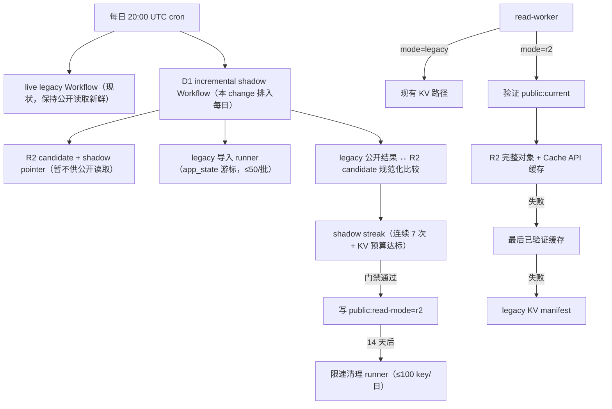

# migrate-public-reads-from-kv 技术设计

## 1. 目标与非目标

**目标**

- 把 legacy KV 的逐 subject 媒体状态（`subject:detail` / `subject:meta` /
  `image:status` / `subject:refresh`）幂等导入 D1 `subject_media`，复用现有
  `airing-cal-images` R2 key，不复制图片二进制。
- 每日对「legacy 公开结果」与「R2 `PublicSnapshotV1` 候选」做规范化等价比较，
  连续 7 次一致且 KV 写预算达标后，才允许公开读取切换到 R2。
- Read Worker 验证 pointer/schema/generation/hash 后读取 R2 完整对象，
  保留「Cache API 最后已验证版本 → legacy KV manifest」两级 fallback。
- 切换稳定 14 天后以每天最多 100 个 key 的限速清理 legacy 逐 subject key，
  保留至少一个已验证 R2 generation。

**非目标**

- 不重新抓取或复制图片，不改变公开 HTTP URL、分页参数或响应 shape。
- 迁移期间不双写 legacy 逐 subject KV（D1 路径只写 D1）。
- 不设计 sync-run 过期/删除策略（沿用现有留存语义）。

## 2. 现状与集成点

- `read-worker`：仍从 legacy KV 读取 `snapshot:active`/versioned keys，并按
  subject 读取 `image:status` / `subject:meta` / `subject:detail` 水合图片、
  NSFW、集数与评分；D1 与 data R2 binding 已存在但 handler 不使用。
- `sync-worker`：每日 20:00 UTC cron 触发 live legacy Workflow（V3，写
  legacy KV）；D1 incremental shadow（V4，media 写 D1 + image R2）当前仅
  manual 触发。`r2-publication.ts` 的 `POINTER_KEY = 'public:current'` 在
  shadow 发布时写入 pointer，`snapshots/v1/{generation}-{hash}.json` 为不可变
  对象，pointer 是最后一步且先验证后写；本 change 迁移期将 pointer 写入改为
  `public:shadow-current`，正式 `public:current` 仅在门禁通过后写入。
- `D1`：`subject_media` 已保存 detail/hash/NSFW/源 URL/R2 ref/检查与重试字段；
  `app_state` 支持带版本的单调写入；`sync_budget` 记录每日 media 预算。
- `PublicSnapshotV1` 已包含五类 collections、calendar、summary 与图片/NSFW
  投影（`d1-sync.ts` 的 `publicationInput` 已按 `subject_media` 投影）。

## 3. 总体架构与数据流

## 4. 模块设计

### 4.1 Legacy 迁移 runner

- 位置：`apps/sync-worker/src/legacy-migration.ts`，作为每日 shadow 路径的一步
  执行，同时导出 `runLegacyMigration(...)` 供独立调用与测试；不新增 Cron。
- 输入：当前 D1 `collection_items` 去重 subject 集合（按 `subject_id` 升序）
  + `app_state['migrate:legacy:cursor']`。
- 每批最多 50 个 subject：读取四个 legacy key；仅当 D1 `subject_media` 行缺失
  或 D1 字段更旧（`checked_at` 为空且 legacy detail 有效）时导入；复用现有
  `upsertSubjectMedia`，R2 ref 原样保留，不触发图片下载或 R2 PUT。
- 幂等：已导入 subject 在 D1 有更新状态时跳过 legacy 值；缺 key 记入
  `missing_keys` 计数并继续；批次中断后从持久化游标续跑。
- 计数写入 `app_state['migrate:legacy:summary']`；cursor 用
  `putAppStateIfNewer` 单调推进，重放安全。

### 4.2 Shadow 等价比较

- 构建 legacy 公开结果：读取 legacy snapshot versioned keys（无 active 时读
  legacy keys）+ 与 read-worker 相同的水合逻辑（images/nsfw/eps/rating）→
  五类 collections、calendar、summary；水合同时包含 `image_status`
  （无 image:status 记录时默认 `pending_next_cron`，与 read-worker 一致）。
- 规范化：稳定排序（collection 按 subject_id、calendar 按 weekday 与 item
  顺序、summary 按键），剔除运行时字段（`published_at`、generation、分页与
  查询元数据）；`image_status` 归一化为 coarse 三态
  （cached / failed / pending；queued→pending、missing_source→failed），
  避免 legacy 状态粒度差异阻塞门禁；其余业务字段全量比较。
- `compareShadowSnapshots(legacy, r2)` 返回 `{ equal, diffs }`；diff 为脱敏
  摘要（subject_id、字段路径、期望/实际截断值），有界条数。
- streak 写入 `app_state['migrate:shadow:streak']`：业务一致 +1，任何业务差异
  重置为 0 并保存差异摘要；两端仅发布时间不同视为一致。R2 对象已生成的不因
  差异删除。
- KV 预算达标：每日记录 legacy 逐 subject KV 写计数（live workflow 的 daily
  counters 派生）到 `app_state['migrate:kv-budget-daily']`；连续 7 日
  `<=100` 且 media budget 未突破 hard limit 才视为达标。

### 4.2.1 R2 快照响应契约（image_status / rating）

- `PublicCollectionItemV1` 增加必需的 `image_status` 与可选的 `rating`；
  `PublicCalendarSubjectV1` 增加必需的 `image_status`（`rating` 保持可选）。
- D1 投影从 `subject_media` 派生 `image_status`：R2 key 可解析 → `cached`；
  有 `error_code` → `failed`；否则 `pending_next_cron`。`rating` 取自
  `detail_json.subject.rating`，与 legacy 响应水合来源一致；无 media 的
  calendar 条目默认 `pending_next_cron`。
- read-worker 的 R2 路径直接服务 snapshot 条目，因此 snapshot 条目必须携带
  legacy 响应层水合提供的全部字段，否则切换后 JSON shape 会静默变化且
  shadow 比较无法检出。

### 4.3 公开读取切换与 fallback

- 状态：KV key `public:read-mode`（`'legacy' | 'r2'`），权威值存 D1
  `app_state['migrate:read-mode']`，sync 切换时先写 D1 再镜像 KV（KV 失败不
  回滚 D1，重试镜像）。
- 迁移期 shadow 发布把 pointer 写入 `public:shadow-current`（同
  `PublicSnapshotPointerV1` 契约），read-worker 忽略该键；切换动作在
  streak ≥ 7 且预算达标后，sync 执行「验证 shadow pointer → 提升为
  `public:current` → 写 read-mode=r2」，正式 pointer 的写仍是最后一步。
- read-worker（mode=r2）：解析并验证 `public:current`
  （schema_version=1、generation、hash、r2_key、published_at）→ R2 GET
  `snapshots/v1/{generation}-{hash}.json` → 内存分页。失败顺序：Cache API
  最后已验证版本（key 含 hash）→ legacy KV manifest（现有
  `activeSnapshot` 路径）。降级状态计入 health。
- 分页/契约：与现状一致（`type`/`page`/`limit`/`cursor`，错误 JSON 与状态码
  不变）；calendar/summary 直接返回对象内容。

### 4.4 限速清理

- 条件：`read-mode=r2` 且切换时间 ≥ 14 天（`migrate:read-mode` 记录
  `switched_at`）。
- 每批 ≤100 个 legacy key（四类逐 subject key 按 subject_id 升序），删除前
  确认 read-mode=r2、`public:current` 已验证、目标 R2 generation 存在；
  删除后推进 `app_state['migrate:cleanup:cursor']`；计数记 summary。
- 停止/恢复：cursor 持久化，失败批次不推进；文档提供 runbook。

### 4.5 health 扩展

- `/api/health` 追加（不删除现有字段）：
  - `snapshot: { source: 'legacy'|'r2', generation, r2_key, verified_at }`
  - `migration: { shadow_streak, cursor, imported, skipped, missing_keys,
    kv_budget_ok, read_mode }`
  - `budget: { media: { reserved, consumed, soft_limit, hard_limit } }`
- 数据源：D1 `sync_runs` / `sync_budget` / `app_state` 各迁移 key；KV 不可用时
  只追加 `degraded: true`，不破坏既有契约。

## 5. 数据模型与 app_state keys

无新 D1 表、无 migration SQL；新增 typed app_state values：

| key | 类型 | 内容 |
|---|---|---|
| `migrate:legacy:cursor` | `MigrationCursorV1` | last subject_id、批次、updated_at |
| `migrate:legacy:summary` | `MigrationSummaryV1` | imported/skipped/missing/errored 计数 |
| `migrate:shadow:streak` | `ShadowStreakV1` | streak、last_success_at、diff 摘要 |
| `migrate:read-mode` | `ReadModeV1` | legacy/r2、switched_at（权威） |
| `migrate:kv-budget-daily` | `KvBudgetDailyV1` | 每日 legacy 逐 subject KV 写计数 |
| `migrate:cleanup:cursor` | `CleanupCursorV1` | 清理游标与计数 |

类型定义放 `packages/storage/src/d1-types.ts`（或独立 `legacy-migration-types.ts`
 再 re-export）；KV 镜像键 `public:read-mode` 不参与公开 snapshot hash。

## 6. 接口、部署与运行

- 无新 Worker、无新资源：复用 D1/KV/两个 R2/Queue；部署沿用现有
  `resolve → migration → read/media → sync → frontend` 流水线；`build:check`
  断言 read-worker 的 D1/data-R2 binding 变为实际使用（binding 已存在）。
- 每日 cron 不变（20:00 UTC）：live legacy Workflow 保持现状保证公开读取
  新鲜；D1 shadow + 迁移 + 比较作为同一 Workflow 的后续阶段（或同一 Workflow
  内第二条分支），失败不阻塞 legacy 发布。
- 上线后时间线：部署 → 7 次每日 shadow 一致且预算达标 → 切 `read-mode=r2` →
  14 天只读观察 → 每日 ≤100 key 清理。

## 7. 风险与取舍

- legacy 状态不完整 → 缺失项由正常媒体轮转补全，不阻塞其余迁移。
- 比较噪声（排序/运行时字段）→ 规范化排序并剔除运行时字段；diff 摘要脱敏。
- R2 暂时不可用 → Cache API 最后验证版 + legacy KV 双 fallback 保证连续性。
- 清理后回滚能力下降 → 14 天观察期后才清理；回滚依赖保留的 R2 generation，
  不依赖已删 legacy metadata；回滚操作只切 read-mode，不回滚 D1 行。
- KV 预算口径以 Worker 内可观测的每日逐 subject 写计数为准，控制面配额以
  生产验收观测为准（OpenSpec 6.1/6.2）。

## 8. 测试策略（TDD）

1. 迁移：批次中断续跑、重复导入、缺失 legacy key、R2 ref 复用、D1 更新覆盖
   保护（R2 PUT 为零断言）。
2. Shadow：规范化排序、仅发布时间差异视为一致、业务差异重置 streak、diff
   摘要脱敏、6 次后差异拒绝切换。
3. 读切换：pointer/schema/hash 校验失败、R2 GET 失败时缓存/legacy fallback
   顺序、分页与 API 契约兼容、Cache API 最后验证版命中。
4. 门禁与回滚：streak<7 拒绝、切换后回滚只切 read-mode、不删 R2 对象。
5. 清理：14 天内零删除、≤100 key/日、保留至少一个已验证 generation、失败
   批次不推进游标。
6. 全仓：`pnpm test` / `pnpm typecheck` / `pnpm build:check` / strict
   OpenSpec / `git diff --check`；read-worker 与 sync-worker 现有测试保持通过。

## 9. 上线门禁与回滚

- 门禁：连续 7 次每日 shadow 一致 + 连续 7 日 KV 写预算达标 + 全仓门禁 +
  生产冒烟（frontend/health/collections/calendar 200 且 shape 不变）。
- 回滚：`read-mode` 切回 `legacy`（保留已验证 R2 对象与 generation）；
  永不回滚 D1 数据；清理启用后回滚能力按 §7 记录。
- Spec Patch：无（现有 5 个 delta spec 已覆盖验收场景；实现中发现缺口按
  comet-design 小规模增量回写并注明）。
